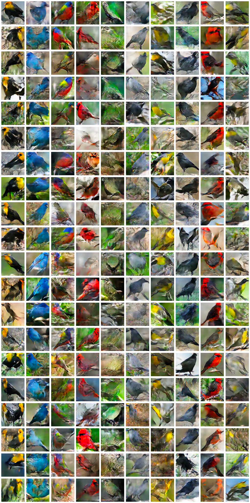

# KSY_GAN
This is a semestral project focused on Generative Adversial Networks with implementation of such network.

The Stage I GAN model based on Conditional DCGAN featured in the jupyter notebook (core file of this repository) was trained on the dataset of Caltech Birds 200. If you want to use this model and train it for yourself, you have to first download this dataset from its official site http://www.vision.caltech.edu/datasets/cub_200_2011/ into CUB_200_2011 directory inside the clone of this repository on your computer.

Also if you want to use our pretrained weights for Stage I generator, you can download them from our Google Drive https://drive.google.com/file/d/1a3YuT4DT0JB4WL80C18UpQOxrhmRICqA/view?usp=drive_link .

Then it is simple to follow and run each code block in the jupyter notebook to prepare the model and train it. Although the notebook is centered around simple Stage I GAN able to produce 64x64x3 images of 10 bird classes, there is preparation for Stage II GAN, that would output 256x256x3 images of up to 200 bird classes.

The network structure is build using Tensorflow, specificaly Keras extension. To use it on your computer, you can install tensorflow and other libraries used in this notebook by this command:
```
pip install numpy tensorflow pandas opencv-python tensorflow-gan icecream
```
Tensorflow should by itself choose your GPU card (if you have one) and it is recomended to train this model on a GPU as it should run faster.

In the GoogleColabVersion directory, there is a jupyter notebook which trains cdcgan architecture on celebA dataset. The used dataset can be downloaded at https://mmlab.ie.cuhk.edu.hk/projects/CelebA.html . Please note that the version was made to run on google colab, and the code would need a slight modifications in order to run on local computer. The codes for processing the celebA dataset can be found in CelebritiesDatasetUtils directory.

A simple GUI which produces images based on user input, and showcases the abilities of trained networks, can be found in the GUI directory.

# References:
Conditional DCGAN model was build following tutorial at this site: https://machinelearningmastery.com/how-to-develop-a-conditional-generative-adversarial-network-from-scratch/ , but partialy altered to be able to work with birds dataset.
Stage II GAN of the potential StackGAN was influenced by this repository: https://github.com/hanzhanggit/StackGAN


